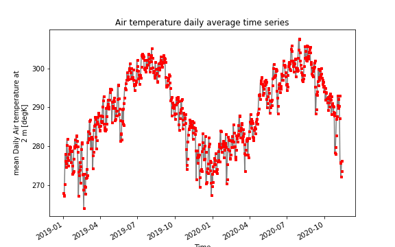
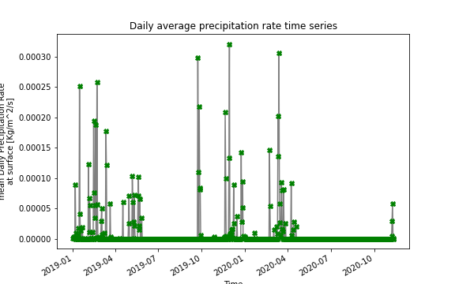

# Homework # 12 (Week 12)
## Name: Shweta Narkhede
#### Submission date: Nov, 16th, 2020
___
### Grade
3/3 - Great job!
___
## **Assignment Questions**

**1. A brief summary of the how you chose to generate your forecast this week.**

- I continued to use the AR model that I have developed earlier but made some modifications to it.
- Added two more input data series of weekly averaged Air temperature and precipitation rate
- Looking at the incraesing flow lately in past few weeks, I have added an correction factor of 80 cfs to the forecasts generated through AR model.
___

**2. A description of the dataset you added**

**What is the dataset? Why did you choose it?**
- Two new daily average timeseries were added to the analysis this week namely Air temperature and precipitation rate for the period of 2019 and 2020 until Nov 12th 2020.
- Knowing precipitation rate and air temperature in the location of streamflow station would increase accuaracy of prediction, thus I chose to use this data.

**What is the spatial and temporal resolution and extent of the data ?
Where did you get the data from?**
- Spatial resolution is bounding box of latitude (34N to 36N)and longitude (247E to 249E) for each dataset.
- Temporal resolution is daily averaged data for period 2019-01-01 to 2020-11-12.

**Where did you get the data from?**
- Data was dowwnloaded from [NOAA Physical Sciences Laboratory Website](https://psl.noaa.gov/cgi-bin/db_search/SearchMenus.pl)

**What was your approach to extracting and aggregating it into something useful to you?**

- The daily averaged data was converted to weekly average to use with weekly streamflow data as a input to AR model.
- The air temperature values were converted from degree Kelvin to degree Celcius before feeding to AR model
- Out of entire dataset, only data of August to November months was used for analysis.

**A plot of the dataset you added. This can be a timeseries, map, histogram or any other plot that you think is a good summary of what you added.**

