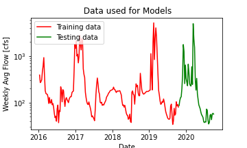
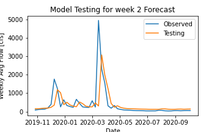
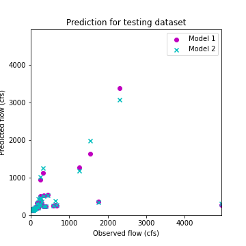

# Homework # 6 (Week 6)
## Name: Shweta Narkhede
#### Submission date: Oct 4th, 2020

___
### Grade
3/3 - Great job! I really like your graphs.
___
## **Forecast Summary**
- I tried to figure out the percentage change in mean weekly streamsflows from year to year and from week to week in same year. For the current forecast I preferred to stick to year 2019 and 2020 as trend in earlier years was quite fluctuating.
- I plotted the mean weekly flow in Sept and Oct for past 3 years to visualize the trend.
- The mean percenatge change in weekly flow was calculated for record of 2018 to 2020. The forecast for next few weeks was calculated based on mean percentage change in flow in 2018 and 2019.
-
-
___
## **Assignment Questions**
___
1. **A summary of the AR model that you ended up building, including (1) what you are using as your prediction variables, (2) the final equation for your model and (3) what you used as your testing and training periods. In your discussion please include graphical outputs that support why you made the decisions you did with your model.**

- For forecasting week 1 streamflow: Model 1

    Prediction variables = streamflow at previous timestep Q(t-1) cfs
    Equation for model: Q(t+1) = 110.81 + 0.6627 * Q(t)
    According to this equation current prediction for next week is 148.518 cfs (intuitively quite high)

- For forecasting week 2 streamflow: Model 2

    Prediction variables = streamflow at previous timestep Q(t-1), and Q at two timesteps back Q(t-2) cfs

    Equation for model: Q(t+2) = 99.5035 + 0.5960 * Q(t) + 0.1007*Q(t-1)
    According to this equation current prediction for week 2 is 133.418 cfs (high considering recent records)

- Out of entire data set I used data for years 2016 to 2020.

Out of which first 80% data was used for training/calibrating model and rest 20% was used for testing the model performance.For both models, same data partition was used.

2. **Provide an analysis of your final model performance. This should include at least one graph that shows the historical vs predicted streamflow and some discussion of qualitatively how you think your model is good or bad.**

- Overall both models seemed to perform poorly. The coefficient of determination for training itself was as low as 0.438 for Model 1 and 0.444 for Model 2. This goodness of fit for model is considered as a poorly fit model. Exact same data was used for model 2 training.

- The plot 1 below shows the prediction outPut for training data. Although, visual analysis may say its not very bad fit, consistent over-prediction for low flows and under-prediction for high flows is noted along with time-lag. The time-lag effect due to auto-correlation makes model futile to use for time sensitive variable like streamflow.

- Testing plots clearly indicates the poor performance of model.  

- Scatter for both models plotted together leans towards overfitting of the model, reason being, more data points of low flow in the testing data set. Model consistently over-predicted for low flows.

- Thus, it can be said that these Auto-regression Models are not good enough to make streamflow predictions.

3. **Finally, provide discussion on what you actually used for your forecast. Did you use your AR model, why or why not? If not how did you generate your forecast this week?**

- I did not use AR models for forecasting stream flows owing to models' clear poor performance. As shown in above plots, both models were poorly fitted. Even after trying to fit for varying range of historical records, models were far from even a good fit (Coefficient of determination in the range of 0.1 to 0.4).
- I decided to work out forecast based on weekly flow variation in recent years i.e. from year 2019. I aggregated weekly mean flows in the month of September and October in 2019 and 2020.
- Percentage change (+/-) for this week to week flow variation was calculated for past weeks from 2019. Using the mean percentage change in past year during the weeks of October, streamflow is forecasted for this year.
