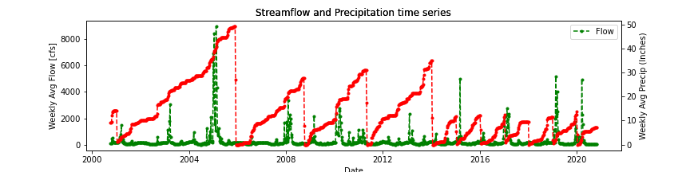
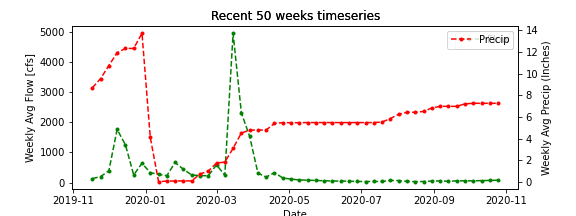

# Homework # 9 (Week 9)
## Name: Shweta Narkhede
#### Submission date: Oct, 26th, 2020
___
## **Assignment Questions**
___
1. **A brief summary of how you chose to generate your forecast this week?**

- This week forecasts were generated using Auto-Regressive model with 8-time steps lagged inputs. I did not use new precipitation times series this week.
- I will include this new precipitation time series in AR model next week. I might be able to use lesser time lagged imputs with additional precipitation input to AR model.

2. **A description of data you added.**

**What is the dataset? Why did you choose it?**
- The data set is an hourly accumulated precipitation. I chose to use this data because it will help improving streamflow prediction when incorporated in AR model. The hourly data can be easily converted to daily and weekly averaged data as per the requirement.
- The period of 2000-10-8 to 2020-10-24 which is an accumulated precipitation hourly precipitation in Inches.

**What location have you chosen?**
- I have chosen the same location as the streamflow data as it was easier to detect at this point. I might add another location on upstream later for better information to find effect of ustream precipipation on streamflow.

**Where did you get the data from?**
- Data was obtained from MesoWest website.

**What was your approach to accessing it?**
- The token was needed to access data, which could be obtained by registering on the portal. Registration also assigned unique API key to identify data accessing user.
- Base url was obtained from their portal for time series data.
- Providing required argument and token details full url was obtained to access the data.
- Requesting to open url and using JSON format to read it, data was extracted for required argument provided earlier.

3. **A plot of your additional time series along with your streamflow time series.**

The plot of additional times series converted into weekly averaged times series plotted together with streamflow data.

Plot of both time series for last 50 weeks for better visualization:

