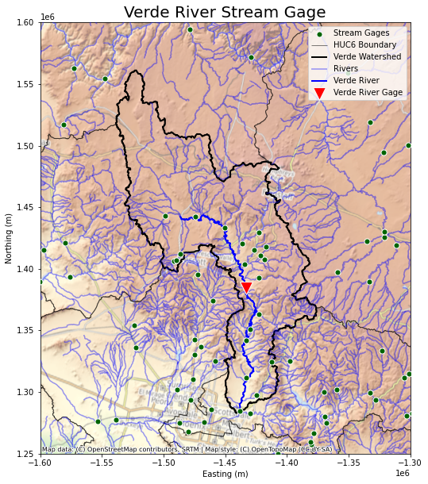
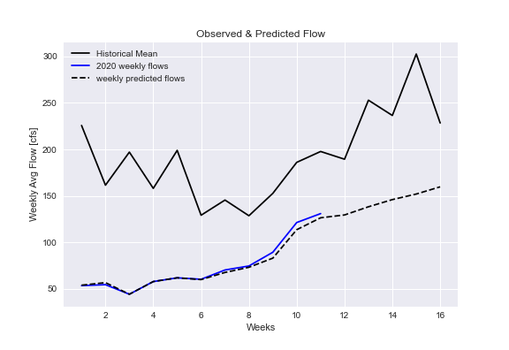

# Shweta Narkhede, Alcely Lau, Richard Marcelain, Scott Schulze; Team SARS
# Homework #11-Group coding

## Forecast Approach
To forecast this week, we took a divide and conquer approach. As a group we each went over each member's forecasting script to decide which we wanted to use. We then repeated this process for the map, using the gallery to decide whos map we wanted to utilize and any changes that we as a group wanted to make. The forecasting script used Shweta's code and the method. Since the 16 weeks forecast is for the 16 weeks of the semester, the script was changed to produce the forecasts for the 16 weeks of the semester starting from the beginning of the semester (Aug 22nd). Now the code will give us a 1 week, 2 week and 16 weeks forecast to feed to forecast entries directly.

Only 2020 data from August to November until last Saturday to feed to an auto-regressive model since, trend is little different this year(abnormally dry). Using this recent data AR model coefficient of determination came out to be as good as 0.95 for all forecasts. Since this is 11th week, the data has been forecasted for 12 to 16 weeks using AR model, while for previous weeks it makes sense to use known weekly records.

## Division of labor
As part of the assignment, we divided our work in the following way: Shweta saw to the forecast script, Alcely created the graph coding, Richard took care of making our map, and Scott did the writing for this week's assignment.

## Week 1 and 2 Forecasts
Our forecast for week 1 is: 129.54, and our forecast for week 2 is: 138.33

## Map of the area
Below is a map of the Verde River watershed. I am happy that I was able to get it in here with little fuss!

## Graph of our forecast plot
The graph illustrates the 16 weeks forecast, the 2020 observed flow, and the historical flow (1989 - 2019) as a base-line.

